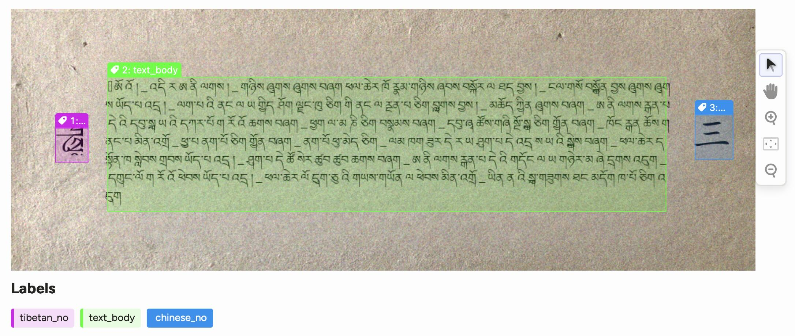

# Tibetan OCR Tools

## Overview

This Python project focuses on detecting and recognizing Tibetan text in images. It provides a complete pipeline from dataset generation to OCR:

1. **Dataset Generation**: Create synthetic training data by embedding Tibetan text into background images
2. **Model Training**: Train a YOLO-based object detection model with optional Weights & Biases logging
3. **Inference**: Detect Tibetan text blocks in new images, including support for Staatsbibliothek zu Berlin digital collections
4. **OCR**: Apply Tesseract OCR to the detected text blocks to extract the actual text content

## Example of synthetic data


## Quick Start Guide

### Installation

```bash
# Clone the repository
git clone https://github.com/CodexAITeam/PechaBridge
cd PechaBridge

# Install dependencies
pip install -r requirements.txt

# Install Tesseract OCR (required for text recognition)
# Ubuntu/Debian: sudo apt-get install tesseract-ocr
# macOS: brew install tesseract
# Windows: Download installer from https://github.com/UB-Mannheim/tesseract/wiki
```

### Complete Workflow

```bash
# 1. Generate dataset
python generate_training_data.py --train_samples 10 --val_samples 10 --font_path_tibetan ext/Microsoft\ Himalaya.ttf --font_path_chinese ext/simkai.ttf --dataset_name tibetan-yolo

# 1.5 Inspect and validate dataset with Label Studio (optional)
# Install Label Studio if not already installed:
# pip install label-studio label-studio-converter

# Set up environment variables for local file serving
export LABEL_STUDIO_LOCAL_FILES_SERVING_ENABLED=true
export LABEL_STUDIO_LOCAL_FILES_DOCUMENT_ROOT=$(pwd)/datasets/tibetan-yolo

# Create classes.txt for Label studio compatibility
echo "tibetan_no\ntext_body\nchinese_no" > datasets/tibetan-yolo/train/classes.txt
echo "tibetan_no\ntext_body\nchinese_no" > datasets/tibetan-yolo/val/classes.txt

# Convert YOLO annotations to Label Studio format
label-studio-converter import yolo -i datasets/tibetan-yolo/train -o ls-tasks.json --image-ext ".png" --image-root-url "/data/local-files/?d=train/images"

# Start Label Studio web interface (opens at http://localhost:8080)
label-studio

# In Label Studio:
# 1. Create a new project:
# 1.1 Go to the project settings and select Cloud Storage.
# 1.2 Click Add Source Storage and select Local files from the Storage Type options.
# 1.3 Set the Absolute local path to `$(pwd)/datasets/tibetan-yolo` (You need to resolv `$(pwd)`)
# 1.4 Click Add storage.
# 2. Import the generated ls-tasks.json file
# 3. Review and validate the generated annotations
# 4. Export corrections if needed

# [1] https://github.com/HumanSignal/label-studio-sdk/tree/master/src/label_studio_sdk/converter#tutorial-importing-yolo-pre-annotated-images-to-label-studio-using-local-storage

# 2. Train model
python train_model.py --epochs 100 --export

# 3. Run inference (object detection only)
# On local images:
yolo predict task=detect model=runs/detect/train/weights/best.torchscript imgsz=1024 source=data/my_inference_data/*.jpg

# On Staatsbibliothek zu Berlin data:
python inference_sbb.py --ppn PPN12345678 --model runs/detect/train/weights/best.torchscript

# 4. Run OCR on detected text blocks
# On local images:
python ocr_on_detections.py --source data/my_inference_data/*.jpg --model runs/detect/train/weights/best.torchscript --lang bod

# On Staatsbibliothek zu Berlin data:
python ocr_on_detections.py --ppn PPN12345678 --model runs/detect/train/weights/best.torchscript --lang bod
```

## Features

- **Automated Dataset Generation**: Create training and validation datasets for Tibetan text detection
- **Customizable Parameters**: Configure background images, corpora, font, image size, and more
- **Text Generation Options**: Use synthetic Tibetan text or existing corpora
- **Advanced Image Processing**: Apply rotation and noise augmentation strategies
- **Multiprocessing Support**: Leverage parallel processing for efficient dataset generation
- **Experiment Tracking**: Integration with Weights & Biases for monitoring training progress
- **Specialized Inference**: Support for Staatsbibliothek zu Berlin digital collections
- **OCR Integration**: Extract text from detected text blocks using Tesseract OCR

## Code Structure

The project has been refactored to improve modularity and reduce redundancy:

### Core Scripts

- **generate_training_data.py**: Creates synthetic training data
- **train_model.py**: Trains the YOLO model with optional W&B logging
- **inference_sbb.py**: Performs inference on Staatsbibliothek zu Berlin data
- **ocr_on_detections.py**: Applies OCR to detected text blocks

### Utility Library

The `tibetan_utils` package contains shared functionality used across the project:

- **tibetan_utils.config**: Configuration constants and settings
- **tibetan_utils.arg_utils**: Command-line argument parsing utilities
- **tibetan_utils.io_utils**: File and directory operations
- **tibetan_utils.image_utils**: Image processing functions
- **tibetan_utils.model_utils**: Model loading, training, and inference
- **tibetan_utils.ocr_utils**: OCR processing utilities
- **tibetan_utils.sbb_utils**: Staatsbibliothek zu Berlin API integration

## Detailed Documentation

### 1. Dataset Generation

The dataset generation script creates synthetic training data by embedding Tibetan text into background images.

```bash
python generate_training_data.py --train_samples 1000 --val_samples 200 --augmentation rotate
```

#### Dataset Generation Arguments

| Argument | Description | Default |
|----------|-------------|---------|
| `--background_train` | Folder with background images for training | './data/background_images_train/' |
| `--background_val` | Folder with background images for validation | './data/background_images_val/' |
| `--dataset_name` | Folder for the generated YOLO dataset | 'yolo_tibetan/' |
| `--corpora_folder` | Folder with Tibetan corpora | './data/corpora/Tibetan Number Words/' |
| `--train_samples` | Number of training samples to generate | 100 |
| `--val_samples` | Number of validation samples to generate | 100 |
| `--no_cols` | Number of text columns to generate [1-5] | 1 |
| `--font_path` | Path to a Tibetan font file | 'ext/Microsoft Himalaya.ttf' |
| `--single_label` | Use a single label "tibetan" for all files | flag |
| `--debug` | Enable debug mode for verbose output | flag |
| `--image_size` | Size of generated images in pixels | 1024 |
| `--augmentation` | Type of augmentation to apply ['rotate', 'noise'] | 'noise' |

### 2. Model Training

After generating the dataset, you can train a YOLO model using our dedicated training script.

```bash
python train_model.py --epochs 100 --imgsz 1024 --export
```

#### Training Arguments

| Argument | Description | Default |
|----------|-------------|---------|
| `--dataset` | Name of the dataset folder | 'yolo_tibetan/' |
| `--model` | Path to the base model | 'yolov8n.pt' |
| `--epochs` | Number of training epochs | 100 |
| `--batch` | Batch size for training | 16 |
| `--imgsz` | Image size for training | 1024 |
| `--workers` | Number of workers for data loading | 8 |
| `--device` | Device for training (e.g., cpu, 0, 0,1,2,3) | '' |
| `--project` | Project name for output | 'runs/detect' |
| `--name` | Experiment name | 'train' |
| `--export` | Export the model after training as TorchScript | flag |
| `--patience` | EarlyStopping patience in epochs | 50 |

#### Weights & Biases Integration

The training script includes integration with [Weights & Biases](https://wandb.ai/) for experiment tracking and visualization.

```bash
python train_model.py --epochs 100 --wandb --wandb-project TibetanOCR
```

| Argument | Description | Default |
|----------|-------------|---------|
| `--wandb` | Enable Weights & Biases logging | flag |
| `--wandb-project` | W&B project name | 'TibetanOCR' |
| `--wandb-entity` | W&B entity (team or username) | None |
| `--wandb-tags` | Comma-separated tags for the experiment | None |
| `--wandb-name` | Name of the experiment in wandb | same as --name |

When wandb logging is enabled, the script will:
- Log training metrics (loss, mAP, precision, recall, etc.)
- Upload dataset samples for visualization
- Save model checkpoints as artifacts
- Generate plots and confusion matrices

#### Alternative: Ultralytics CLI

You can also use the Ultralytics CLI directly:

```bash
# Train the model
yolo detect train data=yolo_tibetan/data.yml epochs=100 imgsz=1024 model=yolov8n.pt

# Export the model
yolo detect export model=runs/detect/train/weights/best.pt 
```

### 3. Inference

#### Standard Inference

For inference on local image files:

```bash
yolo predict task=detect model=runs/detect/train/weights/best.torchscript imgsz=1024 source=data/my_inference_data/*.jpg
```

The results are saved to folder `runs/detect/predict`

#### Inference on Staatsbibliothek zu Berlin Data

For inference on documents from the Staatsbibliothek zu Berlin, use our specialized script:

```bash
python inference_sbb.py --ppn PPN12345678 --model runs/detect/train/weights/best.torchscript
```

If you encounter SSL certificate issues, you can use the `--no-ssl-verify` option:

```bash
python inference_sbb.py --ppn PPN12345678 --model runs/detect/train/weights/best.torchscript --no-ssl-verify
```

| Argument | Description | Default |
|----------|-------------|---------|
| `--ppn` | PPN (Pica Production Number) of the document | required |
| `--model` | Path to the trained model | required |
| `--imgsz` | Image size for inference | 1024 |
| `--conf` | Confidence threshold for detections | 0.25 |
| `--download` | Download images instead of processing them directly | flag |
| `--output` | Directory for saving downloaded images | 'sbb_images' |
| `--max-images` | Maximum number of images for inference (0 = all) | 0 |
| `--no-ssl-verify` | Disable SSL certificate verification | flag |

### 4. OCR on Detected Text Blocks

The OCR script applies Tesseract OCR to text blocks detected by the YOLO model:

```bash
python ocr_on_detections.py --source image.jpg --model runs/detect/train/weights/best.pt --lang bod
```

#### OCR Arguments

| Argument | Description | Default |
|----------|-------------|---------|
| `--source` | Path to image or directory | required (if no --ppn) |
| `--ppn` | PPN for Staatsbibliothek zu Berlin data | required (if no --source) |
| `--model` | Path to the trained model | required |
| `--lang` | Language for Tesseract OCR | 'eng+deu' |
| `--tesseract-config` | Additional Tesseract configuration | '' |
| `--save-crops` | Save cropped text blocks as images | flag |
| `--output` | Directory for saving results | 'ocr_results' |
| `--no-ssl-verify` | Disable SSL certificate verification | flag |

#### OCR Output Format

The script generates a JSON file for each processed image with the following structure:

```json
{
  "image_name": "example.jpg",
  "detections": [
    {
      "id": 0,
      "box": {
        "x": 0.5,
        "y": 0.3,
        "width": 0.2,
        "height": 0.1
      },
      "confidence": 0.95,
      "class": 0,
      "text": "Recognized Tibetan text from this block"
    }
  ]
}
```

## Contributing

Contributions are welcome! Please feel free to submit a Pull Request.

## License

This project is licensed under the MIT License - see the [LICENSE](LICENSE) file for details.
