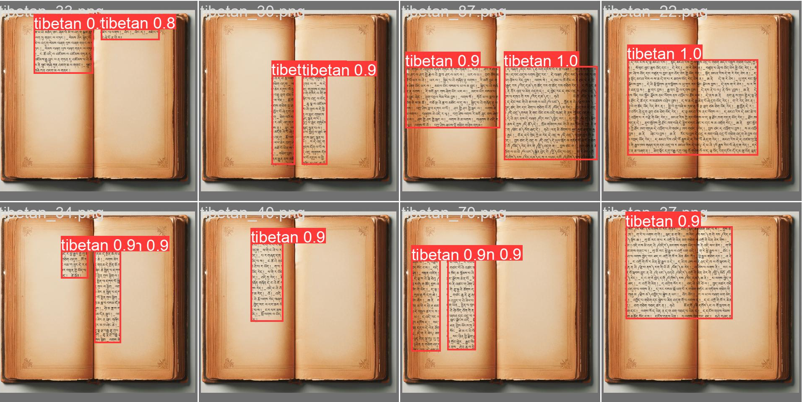
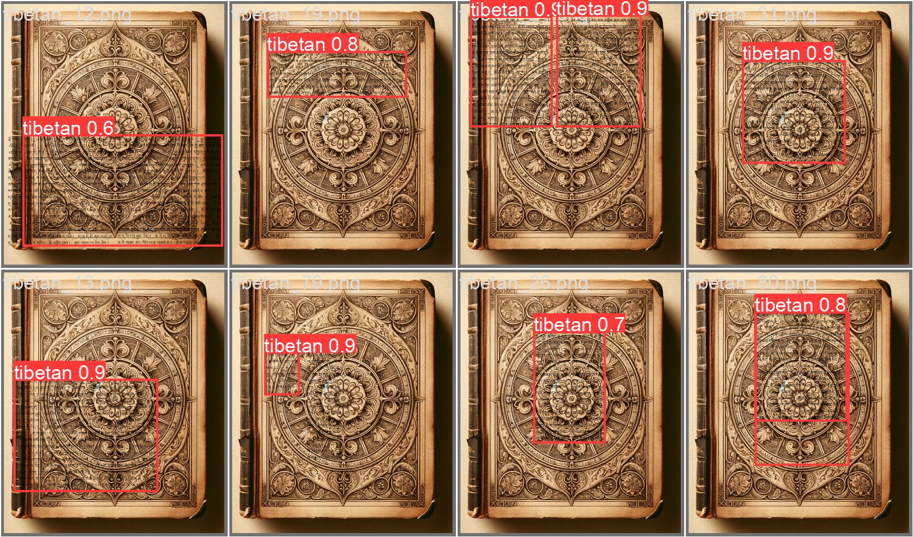

# Tibetan OCR Tools

## Overview
This Python project focuses on generating training data for detecting columns or text blocks of Tibetan texts by embedding Tibetan text into images. It provides a flexible and customizable way to create datasets for machine learning models, particularly for YOLO-based object detection tasks.





The project includes functionality for generating synthetic Tibetan text, reading from existing Tibetan corpora, applying various augmentations, and creating YOLO-compatible datasets.

## Features
- **Automated Dataset Generation**: Simplifies the process of creating training and validation datasets for Tibetan text detection.
- **Customizable Input**: Allows users to specify various parameters like background images, corpora, font, image size, and more.
- **Text Generation**: Supports both synthetic Tibetan text generation and reading from existing corpora.
- **Image Processing**: Utilizes PIL for image manipulation and text rendering.
- **Augmentation**: Includes rotation and noise augmentation strategies.
- **Multiprocessing Support**: Leverages parallel processing for efficient dataset generation.
- **YOLO Compatibility**: Generates datasets in a format compatible with YOLO training.

## Getting Started

### Prerequisites
- Python 3.x
- PIL (Python Imaging Library)
- PyYAML
- Ultralytics YOLO
- Additional Python libraries: numpy, tqdm, etc.

### Installation
Clone the repository to your local machine:

```bash
git clone https://github.com/nih23/Tibetan-NLP.git
cd Tibetan-NLP
```

Install required packages:
```bash
pip install -r requirements.txt
```

### Usage
Run the main script with desired arguments:
```bash
python main.py --train_samples 1000 --val_samples 200 --augmentation rotate
```

### Command-line Arguments

- `--background_train`: Folder with background images for training (default: './data/background_images_train/')
- `--background_val`: Folder with background images for validation (default: './data/background_images_val/')
- `--dataset_name`: Folder for the generated YOLO dataset (default: 'yolo_tibetan/')
- `--corpora_folder`: Folder with Tibetan corpora (default: './data/corpora/Tibetan Number Words/')
- `--train_samples`: Number of training samples to generate (default: 100)
- `--val_samples`: Number of validation samples to generate (default: 100)
- `--no_cols`: Number of text columns to generate [1-5] (default: 1)
- `--font_path`: Path to a Tibetan font file (default: 'ext/Microsoft Himalaya.ttf')
- `--single_label`: Use a single label "tibetan" for all files (flag)
- `--debug`: Enable debug mode for verbose output (flag)
- `--image_size`: Size of generated images in pixels (default: 1024)
- `--augmentation`: Type of augmentation to apply ['rotate', 'noise'] (default: 'noise')


### Training with YOLO
After generating the dataset, you can train a YOLO model with [Ultralytics](https://docs.ultralytics.com/usage/cli/#train) using: 

```bash
yolo detect train data=yolo_tibetan/data.yml epochs=100 imgsz=1024 model=yolov8n.pt
```

The model is then converted into a torchscript for inference:
```bash
yolo detect export model=runs/detect/train9/weights/best.pt 
```

### Inference
We can now employ our trained model for recognition and classification of tibetan text blocks as follows:

```bash
yolo predict task=detect model=runs/detect/train9/weights/best.torchscript imgsz=1024 source=data/my_inference_data/*.jpg
```

The results are then saved to folder `runs/detect/predict`

## Contributing

Contributions are welcome! Please feel free to submit a Pull Request.

## License

This project is licensed under the MIT License - see the [LICENSE](LICENSE) file for details.
