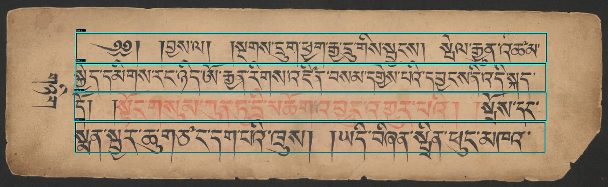

# PechaBridge

PechaBridge is a library for **Tibetan document understanding** with a focus on training OCR and Line Segmentation models for text retrieval in Tibetan script.

The primary entrypoint for end-to-end usage is the unified CLI (`cli.py`), especially `python cli.py ocr-workbench` and `python cli.py batch-ocr`.

## Example: SBB Pecha OCR

The figure below shows an example line segmentation result for a Tibetan pecha
page from the Staatsbibliothek zu Berlin (SBB). Each detected line is passed
through the OCR model to extract the Tibetan text.



Sample OCR output for the page shown above:

``` 
༄༅། །བྱས་ལ། །སྔགས་དྲུག་ཕྱག་རྒྱ་དྲུག་གིས་སྦྱངས། སྤེལ་རྒྱུན་ཤཚམ།
སྐྱིད་དམིགས་དང་ཉིད་ཨོ་རྒྱན་རིགས་འཛིན་བསམ་དགྱེས་པའི་དབྱངས་ནི་འདི་སྐད་
དོ། །སྟོང་གསུམ་ཀུན་ནི་མཆོག་འབུན་འགྱར་བའི། །སྤོས་དང་
སྨན་སྦུར་ཆུ་གཙང་དག་བཞི་ཁྲུས། །ཡ དི་བཞིན་སྲིན་ཕུད་མཁན་
``` 

⚠ The transcript above is current model output (April 2026) and may contain
recognition errors. Accuracy improves with more training data.

## Core Features

- **End-to-end Tibetan Pecha OCR pipeline**: Automatically segments lines on digitised Pecha pages (e.g. from the Staatsbibliothek zu Berlin) using a YOLO-based line segmentation model, then transcribes each line with a fine-tuned Donut VLM. A single `batch-ocr` CLI command covers download → line detection → OCR → transcript export.
- **Synthetic multi-class dataset generation**: Creates YOLO-ready pages for Tibetan number words, Tibetan text blocks, and Chinese number words.
- **Semantic Search Workbench for Tibetan transcripts**: Indexes line-level transcript data in local Qdrant, supports DE/EN, Tibetan Unicode, and Wylie/EWTS query modes, and returns ranked passages with configurable context windows in a Gradio UI plus optional FastAPI endpoints.

### Advanced Research Features
- **Standalone DONUT/TroCR OCR training**: Trains OCR directly on OpenPecha/BDRC line manifests (`train-donut-ocr`) with `none|pb|gray|bdrc|rgb` image preprocessing and CER evaluation.
- **Retrieval encoder training + eval**: Trains ViT/DINOv2 patch encoders with mp-InfoNCE and exports FAISS-ready embeddings plus cross-page evaluation.
- **Dual vision-text encoder (CLIP-style) training**: Trains DINOv2 + text encoder (e.g. ByT5) on line image/text manifests (`line_clip`) for text-to-line and line-to-text retrieval.


## Install

```bash
pip install -r requirements.txt
```

`requirements.txt` is the **unified** dependency file for the repository.
Optional compatibility wrappers live in `requirements/`.

## Pretrained Models

Pretrained PechaBridge models are hosted on HuggingFace:

| Model | HuggingFace Repo | Description |
|-------|-----------------|-------------|
| DONUT OCR | [`TibetanCodexAITeam/PechaBridgeOCR`](https://huggingface.co/TibetanCodexAITeam/PechaBridgeOCR) | VisionEncoderDecoder OCR for Tibetan line images |
| Line Segmentation | [`TibetanCodexAITeam/PechaBridgeLineSegmentation`](https://huggingface.co/TibetanCodexAITeam/PechaBridgeLineSegmentation) | YOLO segmentation model for Tibetan text lines |

### Download (one command)

```bash
# Download both models into models/ (auto-detected by UI and CLI):
python cli.py download-models

# Download only the OCR model:
python cli.py download-models --models ocr

# Download only the line segmentation model:
python cli.py download-models --models line

# Force re-download:
python cli.py download-models --force
```

After download the directory layout is:

```
models/
  ocr/
    PechaBridgeOCR/          ← DONUT checkpoint (auto-detected by the OCR Workbench)
      config.json
      model.safetensors
      tokenizer_config.json
      preprocessor_config.json
      repro/
        image_preprocess.json
        generate_config.json
  line_segmentation/
    PechaBridgeLineSegmentation.pt   ← YOLO .pt (auto-detected by the Workbenches)
```

The UI workbenches scan these directories on startup and populate their model dropdowns automatically — no manual path configuration needed.

### Batch OCR with downloaded models

```bash
python cli.py batch-ocr \
    --ocr-model     models/ocr/PechaBridgeOCR \
    --line-model    models/line_segmentation/PechaBridgeLineSegmentation.pt \
    --layout-engine yolo_line \
    --ocr-engine    donut \
    --input-dir     /path/to/pecha/images
```

Each image produces a `.txt` transcript and an `*_overlay.jpg` with the
detected line boxes drawn on the source image (pass `--no-save-overlay` to
skip the overlay images).

---

## BDRC Models

PechaBridge also integrates the excellent OCR pipeline from the
**[BDRC Tibetan OCR App](https://github.com/buda-base/tibetan-ocr-app)**
by [Buddhist Digital Resource Center (BDRC)](https://bdrc.io).
Many thanks to the BDRC team for their outstanding work on open Tibetan OCR
tooling and for making their models freely available! 🙏

The BDRC assets (line/layout ONNX models + OCR model bundle) are downloaded
from the BDRC GitHub release — no HuggingFace account needed.

### Download BDRC models

```bash
# Download all BDRC assets (line model, layout model, OCR bundle):
python cli.py download-bdrc-models

# Download only the line/layout ONNX models:
python cli.py download-bdrc-models --assets line,layout

# Download only the OCR model bundle:
python cli.py download-bdrc-models --assets ocr

# Force re-download:
python cli.py download-bdrc-models --force
```

After download the directory layout is:

```
models/
  bdrc/
    Lines/
      PhotiLines.onnx      ← BDRC line segmentation ONNX model
      config.json
    Layout/
      photi.onnx           ← BDRC layout ONNX model
      config.json
    OCRModels/
      Woodblock/           ← BDRC OCR model (auto-selected by default)
        ...
```

### Batch OCR with BDRC models

```bash
# BDRC line segmentation + BDRC OCR:
python cli.py batch-ocr \
    --layout-engine   bdrc_line \
    --bdrc-line-model models/bdrc/Layout \
    --ocr-engine      bdrc_ocr \
    --bdrc-ocr-model  models/bdrc/OCRModels/Woodblock \
    --input-dir       /path/to/pecha/images

# BDRC line segmentation + PechaBridge DONUT OCR:
python cli.py batch-ocr \
    --layout-engine   bdrc_line \
    --bdrc-line-model models/bdrc/Layout \
    --ocr-engine      donut \
    --ocr-model       models/ocr/PechaBridgeOCR \
    --input-dir       /path/to/pecha/images
```

> **Tip:** `--bdrc-line-model` and `--bdrc-ocr-model` are optional — when
> omitted the CLI auto-downloads the models into `models/bdrc/` on first use.
> The auto-selected model is `models/bdrc/Layout/` (multi-class layout model),
> which matches the OCR Workbench UI default.

---

## Downloading and OCR-ing Pecha Images from the Staatsbibliothek zu Berlin (SBB / Stabi)

The [Staatsbibliothek zu Berlin (SBB)](https://staatsbibliothek-berlin.de) provides
free access to digitised Tibetan manuscripts and block prints via their IIIF API.
You can download full-resolution page images for any digitised work using its **PPN**
(Pica Production Number).

### One-command workflow: download → line detection → OCR → transcript export

Pass `--ppn` directly to `batch-ocr` to run the full pipeline in a single command.
Images are downloaded automatically before OCR starts:

```bash
# Full pipeline with BDRC layout + DONUT OCR (recommended for pecha pages):
python cli.py batch-ocr \
    --ppn           337138764X \
    --layout-engine bdrc_line \
    --ocr-engine    donut \
    --ocr-model     models/ocr/PechaBridgeOCR

# Full pipeline with BDRC layout + BDRC OCR (no --ocr-model needed):
python cli.py batch-ocr \
    --ppn           337138764X \
    --layout-engine bdrc_line \
    --ocr-engine    bdrc_ocr

# Limit to the first 10 pages and save images to a custom folder:
python cli.py batch-ocr \
    --ppn              337138764X \
    --layout-engine    bdrc_line \
    --ocr-engine       bdrc_ocr \
    --sbb-max-pages    10 \
    --sbb-output-dir   sbb_images/PPN337138764X
```

Downloaded images are saved to `sbb_images/<PPN>/` by default (override with `--sbb-output-dir`).

### Download only (no OCR)

Use `download-sbb-images` to fetch images without running OCR.
A `metadata.json` file is always written alongside the images; it contains the full
document metadata (title, author, date, publisher, language, identifiers, subjects, …)
plus the ordered list of source URLs so transcripts can be matched back to the correct
page later.

```bash
# Download all pages of PPN337138764X into sbb_images/337138764X/ (default):
python cli.py download-sbb-images --ppn 337138764X

# Download into a custom output directory:
python cli.py download-sbb-images --ppn 337138764X --output-dir sbb_images/PPN337138764X

# Limit to the first 10 pages:
python cli.py download-sbb-images --ppn 337138764X --max-pages 10

# Print document metadata to the terminal as well:
python cli.py download-sbb-images --ppn 337138764X --show-metadata

# Reduce parallel workers (default: 8) or disable SSL verification:
python cli.py download-sbb-images --ppn 337138764X --workers 4 --no-verify-ssl
```

The output directory will contain:
- `*.jpg` / `*.png` — full-resolution page images (one file per page)
- `metadata.json` — full document metadata + per-page `{index, filename, source_url}` entries

> **Note:** The SBB IIIF API is publicly accessible — no login or API key required.
> Replace `337138764X` with any other SBB PPN to download a different work.
> You can find PPNs in the [SBB catalogue](https://stabikat.de) or the
> [SBB digital collections](https://digital.staatsbibliothek-berlin.de).
> The layout Workbench (`python cli.py layout-workbench`) also has a built-in **PPN Downloader** tab.

---

## OCR Workbench

The **OCR Workbench** is a dedicated Gradio UI for interactive Tibetan OCR on pecha page images.

```bash
python cli.py ocr-workbench
```

### Quick Start

1. **Download the pretrained models** (once):
   ```bash
   python cli.py download-models
   ```

2. **Start the workbench** — models are auto-detected from `models/ocr/` and `models/line_segmentation/`.

3. **Upload a pecha page image** and click **Run OCR**.

### Modes

| Mode | Description |
|------|-------------|
| **Fully Automatic OCR** | Segments all lines on the page, runs OCR on each, and returns the full transcript. |
| **Manual Mode** | Click a line on the page or draw a bounding box with two clicks to OCR a single region. |

### Line Segmentation Backends

| Backend | When to use |
|---------|-------------|
| **Classical CV** | Fast, no GPU needed. Works well on clean woodblock prints. Requires a YOLO layout model (`models/layout/`). |
| **Pretrained YOLO Model** | Best accuracy for complex or degraded pages. Uses `models/line_segmentation/PechaBridgeLineSegmentation.pt`. |
| **BDRC Line Model** | Alternative ONNX-based segmentation from the BDRC Tibetan OCR app. Auto-downloaded on first use. |

### OCR Engines

| Engine | Description |
|--------|-------------|
| **DONUT** | Default. VisionEncoderDecoder model from `models/ocr/PechaBridgeOCR/`. Preprocessing pipeline is auto-detected from the checkpoint's repro bundle. |
| **BDRC OCR** | ONNX-based CTC OCR from the BDRC Tibetan OCR app. Auto-downloaded on first use. |

### Typical Workflow (Automatic Mode)

```
Upload page image
  → Select line segmentation backend (YOLO recommended)
  → Select OCR engine (DONUT)
  → Click "Run OCR"
  → Inspect annotated page + transcript
  → Save results
```

### Notes

- The DONUT model and YOLO line segmentation model are loaded once and cached in memory for the session.
- The preprocessing pipeline (`bdrc`, `gray`, `rgb`) is read automatically from `repro/image_preprocess.json` inside the checkpoint — no manual selection needed when using downloaded models.
- For remote server usage, use SSH port forwarding and omit `--share`.

## Semantic Search Workbench

The **Semantic Search Workbench** is a Gradio-based retrieval UI for historical Tibetan transcripts.
It is meant for cases where transcripts already exist as page-wise text files and should be searched semantically instead of by exact string match.

Current retrieval flow:

```text
DE / EN query
  -> translate into Classical Tibetan with OpenAI
Tibetan Unicode query
  -> use directly for retrieval
Wylie / EWTS query
  -> convert locally to Tibetan Unicode with pyewts
all modes
  -> embed the Tibetan query with a custom Hugging Face text encoder
  -> search line embeddings in local Qdrant
  -> reconstruct the context window around each hit
  -> resolve the corresponding metadata.json for the hit's pecha
  -> render the associated page scan from the metadata pages/source_url mapping
  -> optionally back-translate the context into English
  -> inspect ranked results, sources, and metadata in Gradio
```

### What The UI Shows

- Explicit query input modes: `DE / EN`, `Tibetan`, and `Wylie (EWTS)`
- The Tibetan query actually used for retrieval, whether translated or converted from Wylie
- Ranked hits with source labels (`pecha | page | line | file`) and human-readable relevance labels
- The matched line plus configurable context lines around it
- The associated page scan for the matched transcript page, when `metadata.json` provides a `pages[].source_url`
- Direct browser links to the source transcript, `metadata.json`, and full page image
- Optional English back-translation of each context window
- Local Qdrant collection status and a manual reindex action
- Search controls for result count (`top_k`) and context-window radius
- A Research Workspace for filtering hits by pecha, focusing one hit in a text/scan reading panel, pinning hits for comparison, and exporting selected evidence as Markdown or JSON
- An optional FastAPI microservice layer for health checks, index status/rebuild, and JSON search responses

### Current UX / Research Focus

The current UI is deliberately retrieval-first rather than answer-first.
It is optimized for philological inspection and traceability:

- the Tibetan retrieval query is shown explicitly
- each hit is rendered as a card with score, source, matched line, and context
- the matching line is visually highlighted inside the context window
- English back-translation and collection metadata are available as expandable details
- the associated page image can be opened directly from the result card
- the Phase 2 Research Workspace supports pecha-level filtering, focused close reading, pinned-hit comparison, and note-friendly exports

### Modular UI And API Layout

The workbench is split into smaller modules:

- `ui.py` builds the Gradio layout and wires events
- `ui_workspace.py` renders and exports the Research Workspace state
- `api.py` exposes the same search/index service through FastAPI endpoints
- `service.py` remains the application service for translation, Qdrant search, context reconstruction, and scan resolution

When `api.enabled: true` is set in `semantic-search-config.yaml`, the CLI starts the FastAPI microservice alongside Gradio.
The default example config exposes it on `127.0.0.1:7861`.

Useful API endpoints:

- `GET /health`
- `GET /config`
- `GET /index`
- `POST /index/rebuild`
- `POST /search`

### Expected Transcript Layout

The workbench expects transcript files grouped by pecha, with one text file per page and a `metadata.json` per pecha folder:

```text
transcripts/
  pecha_1/
    metadata.json
    page_0001.txt
    page_0002.txt
  pecha_2/
    metadata.json
    page_0001.txt
```

Each page file is split on newline boundaries and indexed line-by-line. The page number is derived from the filename using the regex configured in `semantic-search-config.yaml`.
For the standard SBB-style filename layout `PPN337138764X-00000001.txt`, this corresponds to page `1`, `PPN337138764X-00000005.txt` to page `5`, and so on.

The `metadata.json` is expected to contain a `pages` list with entries such as:

```json
{
  "index": 4,
  "filename": "PPN337138764X-00000005_ca6508937e54_4.jpg",
  "source_url": "https://content.staatsbibliothek-berlin.de/dc/PPN337138764X-00000005/full/max/0/default.jpg"
}
```

This is what allows the workbench to render the correct source scan for a retrieval hit.

### Configuration

All runtime settings are externalized.

- Example YAML config: `pechabridge/semantic_search_workbench/semantic-search-config.yaml`
- Example env file: `pechabridge/semantic_search_workbench/.env.example`

The YAML controls:

- transcript root and file naming rules
- Hugging Face model ID for the custom Tibetan CLIP-style text encoder
- local Qdrant storage path, collection name, and distance metric
- chunking and context-window parameters
- OpenAI translation model settings
- Gradio host and port settings
- FastAPI microservice host, port, docs, and log-level settings

The bundled example config uses the page-number regex:

```yaml
page_number_pattern: ".*-([0-9]+)$"
```

so that transcript filenames like `PPN337138764X-00000005.txt` map to page `5`.

Sensitive values such as the OpenAI API key are loaded via `.env` using `python-dotenv`.

### Quick Start

1. Install dependencies:

   ```bash
   pip install -r requirements.txt
   ```

2. Create the environment file:

   ```bash
   cp pechabridge/semantic_search_workbench/.env.example \
      pechabridge/semantic_search_workbench/.env
   ```

3. Edit the example config and point it to your transcript corpus plus Hugging Face model:

   ```text
   pechabridge/semantic_search_workbench/semantic-search-config.yaml
   ```

4. Launch the workbench from the unified CLI:

   ```bash
   python cli.py semantic-search-workbench \
       --config pechabridge/semantic_search_workbench/semantic-search-config.yaml
   ```

Optional: force a full Qdrant rebuild before starting the UI:

```bash
python cli.py semantic-search-workbench \
    --config pechabridge/semantic_search_workbench/semantic-search-config.yaml \
    --reindex
```

Or rebuild the index only and exit:

```bash
python cli.py semantic-search-workbench \
    --config pechabridge/semantic_search_workbench/semantic-search-config.yaml \
    --reindex-only
```

Run only the FastAPI microservice:

```bash
python cli.py semantic-search-workbench \
    --config pechabridge/semantic_search_workbench/semantic-search-config.yaml \
    --api-only
```

### Notes

- The workbench uses a local on-disk Qdrant instance, so the vector index persists between runs.
- Search quality depends strongly on transcript cleanliness and on the configured Tibetan text encoder.
- The current UI is retrieval-first: it focuses on translated queries, evidence windows, metadata inspection, and page-scan validation rather than answer generation.
- To keep Qdrant payloads lightweight, the workbench stores references such as `pecha_path` and `metadata_file` per line and loads `metadata.json` lazily when a hit is rendered.
- Older indices that embedded the full `metadata.json` still work as a fallback, but rebuilding the index is recommended after upgrading to the current metadata-reference layout.

## Running the Workbench

The workbenches can be launched through the CLI with runtime flags:

```bash
python cli.py ocr-workbench --host 127.0.0.1 --port 7865
python cli.py layout-workbench --host 127.0.0.1 --port 7860
```

For remote server usage, omit `--share` and use SSH port forwarding:

```bash
ssh -L 7860:127.0.0.1:7860 <user>@<server>
```

Then open `http://127.0.0.1:7860` on your laptop.

## Unified CLI

The project includes a unified CLI entrypoint:

```bash
python cli.py -h
```

Key commands:

```bash
# Texture LoRA dataset prep
python cli.py prepare-texture-lora-dataset --input_dir ./sbb_images --output_dir ./datasets/texture-lora-dataset

# Train texture LoRA (SDXL or SD2.1 via --model_family)
python cli.py train-texture-lora --dataset_dir ./datasets/texture-lora-dataset --output_dir ./models/texture-lora-sdxl

# Texture augmentation inference
python cli.py texture-augment --input_dir ./datasets/tibetan-yolo-ui/train/images --output_dir ./datasets/tibetan-yolo-ui-textured

# Train image encoder (self-supervised)
python cli.py train-image-encoder --input_dir ./sbb_images --output_dir ./models/image-encoder

# Train text encoder (unsupervised, Unicode-normalized)
python cli.py train-text-encoder --input_dir ./data/corpora --output_dir ./models/text-encoder

# Generate patch retrieval dataset (YOLO textbox -> lines -> multi-scale patches)
python cli.py gen-patches \
  --model ./models/layoutModels/layout_model.pt \
  --input-dir ./sbb_images \
  --output-dir ./datasets/text_patches \
  --no-samples 20 \
  --debug-dump 5

# Generate weak OCR labels for patch crops (optional retrieval weak positives)
python cli.py weak-ocr-label \
  --dataset ./datasets/text_patches \
  --meta ./datasets/text_patches/meta/patches.parquet \
  --out ./datasets/text_patches/meta/weak_ocr.parquet

# Mine cross-page MNN positives for retrieval training
python cli.py mine-mnn-pairs \
  --dataset ./datasets/text_patches \
  --meta ./datasets/text_patches/meta/patches.parquet \
  --out ./datasets/text_patches/meta/mnn_pairs.parquet \
  --config ./configs/mnn_mining.yaml \
  --num-workers 8

# Train patch retrieval encoder with mp-InfoNCE (MNN/OCR/both)
python cli.py train-text-hierarchy-vit \
  --dataset-dir ./datasets/text_patches \
  --output-dir ./models/text_hierarchy_vit_mpnce \
  --model-name-or-path facebook/dinov2-base \
  --train-mode patch_mpnce \
  --positive-sources both \
  --pairs-parquet ./datasets/text_patches/meta/mnn_pairs.parquet \
  --weak-ocr-parquet ./datasets/text_patches/meta/weak_ocr.parquet

# Train line-level dual vision-text encoder (CLIP-style) on OCR manifests
python cli.py train-text-hierarchy-vit \
  --dataset-dir ./datasets/openpecha_ocr_lines \
  --output-dir ./models/line_clip_openpecha_bdrc_dinov2_byt5 \
  --train-mode line_clip \
  --train-manifest ./datasets/openpecha_ocr_lines/train/meta/lines.jsonl \
  --val-manifest ./datasets/openpecha_ocr_lines/eval/meta/lines.jsonl \
  --model-name-or-path facebook/dinov2-base \
  --text-encoder-name-or-path google/byt5-small \
  --image-preprocess-pipeline bdrc

# Warm line_clip workbench corpus cache (best model auto-selected)
python cli.py warm-line-clip-workbench-cache \
  --models-dir ./models \
  --dataset-root ./datasets/openpecha_ocr_lines \
  --splits eval,test \
  --only both \
  --device cpu

# Probe best line_clip model on random samples (in-split and/or cross-split)
python cli.py probe-line-clip-workbench-random-samples \
  --dataset-root ./datasets/openpecha_ocr_lines \
  --cross-split eval:test \
  --samples-per-split 200 \
  --summary-only

# Launch the Semantic Search Workbench
python cli.py semantic-search-workbench \
  --config pechabridge/semantic_search_workbench/semantic-search-config.yaml

# Train Donut/TroCR OCR directly on line manifests (with CER on eval split)
python cli.py train-donut-ocr \
  --train_manifest ./datasets/openpecha_ocr_lines/train/meta/lines.jsonl \
  --val_manifest ./datasets/openpecha_ocr_lines/eval/meta/lines.jsonl \
  --output_dir ./models/donut_openpecha_rgb \
  --model_name_or_path microsoft/trocr-base-stage1 \
  --tokenizer_path ./ext/BoSentencePiece \
  --image_preprocess_pipeline rgb

# Cross-page FAISS evaluation from exported embeddings
python cli.py eval-faiss-crosspage \
  --embeddings-npy ./models/text_hierarchy_vit_mpnce/faiss_embeddings.npy \
  --embeddings-meta ./models/text_hierarchy_vit_mpnce/faiss_embeddings_meta.parquet \
  --mnn-pairs ./datasets/text_patches/meta/mnn_pairs.parquet \
  --output-dir ./models/text_hierarchy_vit_mpnce/eval_crosspage

# Full label-1 OCR workflow (generate -> prepare -> train)
python cli.py run-donut-ocr-workflow \
  --dataset_name tibetan-donut-ocr-label1 \
  --dataset_output_dir ./datasets \
  --font_path_tibetan "ext/Microsoft Himalaya.ttf" \
  --font_path_chinese ext/simkai.ttf \
  --model_output_dir ./models/donut-ocr-label1
```

For the full OCR training workflow, including dataset download, tiny-run warmup, non-square letterboxed training, and checkpoint selection, see [docs/donut_training_guide.md](docs/donut_training_guide.md).

## Model Outputs And Workbench Compatibility

### DONUT/TroCR OCR (`train-donut-ocr`)

Typical outputs in `--output_dir`:

- `checkpoint-*` (step-based HF checkpoints)
- `checkpoint-epoch-<N>-cer-<X>` symlink aliases (if eval happened before save)
- `model/` (final `VisionEncoderDecoderModel`)
- `tokenizer/`
- `image_processor/`
- `train_summary.json`

Each checkpoint also contains a `repro/` bundle with:
- `repro/image_preprocess.json` — preprocessing pipeline name (`bdrc`, `gray`, `rgb`)
- `repro/generate_config.json` — generation parameters (max_length, decoder_start_token_id, …)
- `repro/tokenizer/` + `repro/image_processor/` — self-contained copies for reproducibility

Current Workbench support:

- The Workbench supports the **DONUT OCR workflow runner** (`run-donut-ocr-workflow`) and monitors training logs/output dirs.
- The OCR Workbench auto-scans `models/ocr/` for checkpoints and exposes them in the DONUT dropdown.
- Training and evaluation are fully supported via CLI (`cli.py train-donut-ocr`).

### Dual Vision-Text Encoder (`train-text-hierarchy-vit --train-mode line_clip`)

Typical outputs in `--output_dir`:

- `text_hierarchy_vit_backbone/` (image backbone + image processor)
- `text_hierarchy_projection_head.pt` (image projection head)
- `text_hierarchy_clip_text_encoder/` (HF text encoder + tokenizer)
- `text_hierarchy_clip_text_projection_head.pt` (text projection head)
- `faiss_embeddings.npy`, `faiss_embeddings_meta.parquet`
- `training_config.json`
- optional `checkpoint_step_*` snapshots (image backbone/head checkpoints)

Current Workbench support:

- The Workbench can scan and use the **image backbone + image projection head** for line/block encoding previews and FAISS-related UI flows.
- The **text encoder part** of `line_clip` is currently **not yet consumed by the Workbench UI** (text query encoding remains a CLI / future UI extension topic).
- Training artifacts are therefore usable in the UI for image-side encoding, while full dual-encoder evaluation is primarily CLI-driven.

## Label Studio Notes

For local file serving in Label Studio, set:

```bash
export LABEL_STUDIO_LOCAL_FILES_SERVING_ENABLED=true
export LABEL_STUDIO_LOCAL_FILES_DOCUMENT_ROOT=/absolute/path/to/your/dataset/root
```

Then use the Workbench export actions.

## Documentation Guide

- Full DONUT/TroCR OCR training guide (dataset download, tiny runs, preprocessing, letterboxing, full runs, checkpoint selection): [docs/donut_training_guide.md](docs/donut_training_guide.md)
- CLI command reference and end-to-end examples: [docs/cli.md](docs/cli.md)
- Pseudo-labeling and Label Studio workflow: [docs/pseudo_labeling_label_studio.md](docs/pseudo_labeling_label_studio.md)
- Patch dataset generation (YOLO textbox -> lines -> sub-patches): [docs/dataset_generation.md](docs/dataset_generation.md)
- Robust MNN mining for cross-page positives: [docs/mnn_mining.md](docs/mnn_mining.md)
- Retrieval training with mp-InfoNCE (MNN/OCR weak positives): [docs/retrieval_mpnce_training.md](docs/retrieval_mpnce_training.md)
- DONUT/TroCR OCR training (OpenPecha/BDRC manifests, CER, checkpoints): [docs/donut_ocr.md](docs/donut_ocr.md)
- Line-CLIP dual vision-text encoder training (DINOv2 + text encoder): [docs/line_clip_dual_encoder.md](docs/line_clip_dual_encoder.md)
- line_clip cache warmup + in-split/cross-split probing & evaluation guide: [docs/line_clip_dual_encoder_probe_guide.md](docs/line_clip_dual_encoder_probe_guide.md)
- Weak OCR labeling for patch datasets: [docs/weak_ocr.md](docs/weak_ocr.md)
- Diffusion + LoRA details: [docs/texture_augmentation.md](docs/texture_augmentation.md)
- Retrieval roadmap: [docs/tibetan_ngram_retrieval_plan.md](docs/tibetan_ngram_retrieval_plan.md)
- Chinese number corpus note: [data/corpora/Chinese Number Words/README.md](data/corpora/Chinese%20Number%20Words/README.md)

## License

MIT, see [LICENSE](LICENSE).
